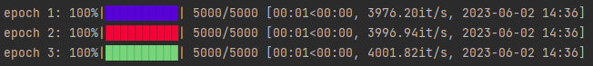
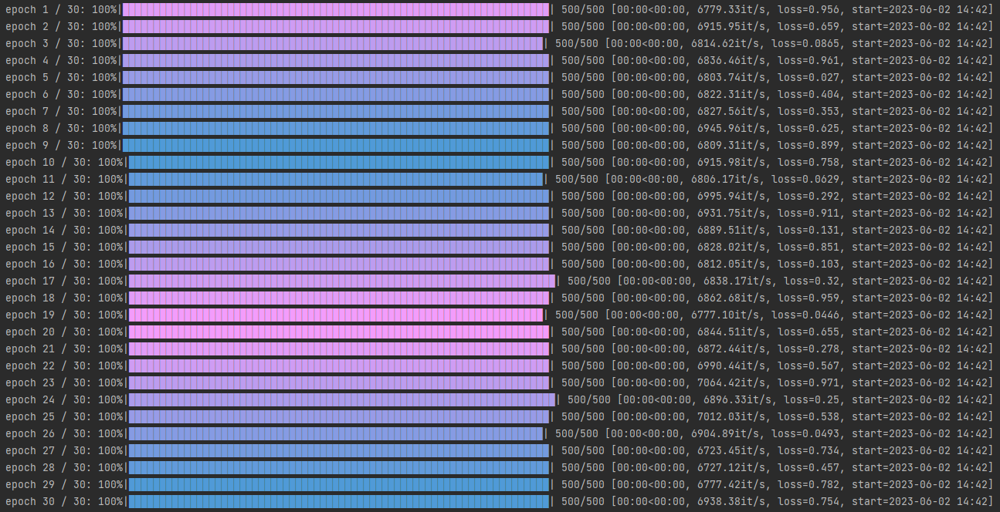

# Progress Bar

This package is based on tqdm. The Progress Bar class inherits from the tqdm class, and its basic usage is the same as tqdm, which can be viewed as the following link:https://tqdm.github.io/.

This package mainly adds the start time and gradient function, the specific usage is as follows.

### 1 Start Time

In the sample below, random colors are used. It is worth noting that the ProgressBar class support the 'prefix' parameter, which makes it easier for humans to understand.

```python
for e in range(3):
    _pb = ProgressBar(range(5000), prefix="epoch {}".format(e + 1), colour='random')
    for i in _pb:
        for j in range(100):
            for k in range(100):
                pass
```




### 2 Gradient Color

Combined with the ColourMaker class in this package, you can achieve multiple progress bar color gradients to make your training enjoyable. The 'metric' is a dictionary-type parameter that displays the data you want to display at the end of the progress bar.

```python
colour_maker = ColourMaker(10)
    for e in range(30):
        m = {
            "loss": random.random()
        }
        _t = ProgressBar(iterable=range(500), ncols=200, 
                         prefix="epoch {} / {}".format(e + 1, 30),
                         metric=m, colour=colour_maker.get_colour())
        for i in _t:
            for j in range(100):
                for k in range(50):
                    pass
```




#### Good Luck with Your Research!